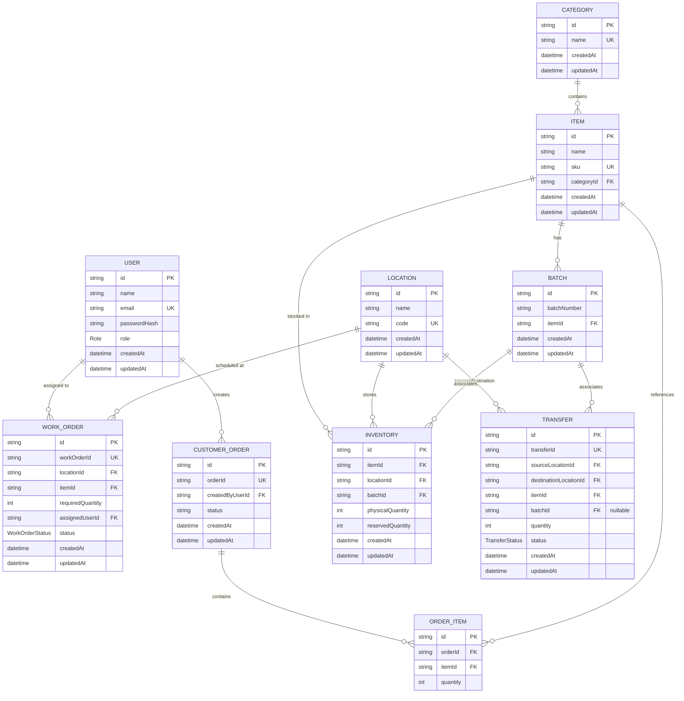

# OpsFlow ERP - Database Documentation & ER Diagram

This document details the schema design, keys, relationships, and constraints in the OpsFlow ERP database.

## Entity Relationship Diagram (Mermaid)

## Relationships & Constraints

1. **Prisma Unique Constraints**:
   - `User.email`
   - `Category.name`
   - `Item.sku`
   - `Location.code`
   - `WorkOrder.workOrderId`
   - `Transfer.transferId`
   - `CustomerOrder.orderId`
   - `Inventory` has a unique compound constraint on: `[itemId, locationId, batchId]` to prevent duplicate ledger entries for the same batch in the same warehouse.

2. **Indexes**:
   - Compounded index on `Inventory([locationId])` and `Inventory([batchId])` to speed up location queries.
   - Indices on `WorkOrder([locationId], [itemId], [assignedUserId])` to optimize scheduling lookup performance.
   - Indices on `Transfer([sourceLocationId], [destinationLocationId], [itemId], [batchId])`.
   - Index on `CustomerOrder([createdByUserId])`.
   - Indices on `OrderItem([orderId], [itemId])`.
