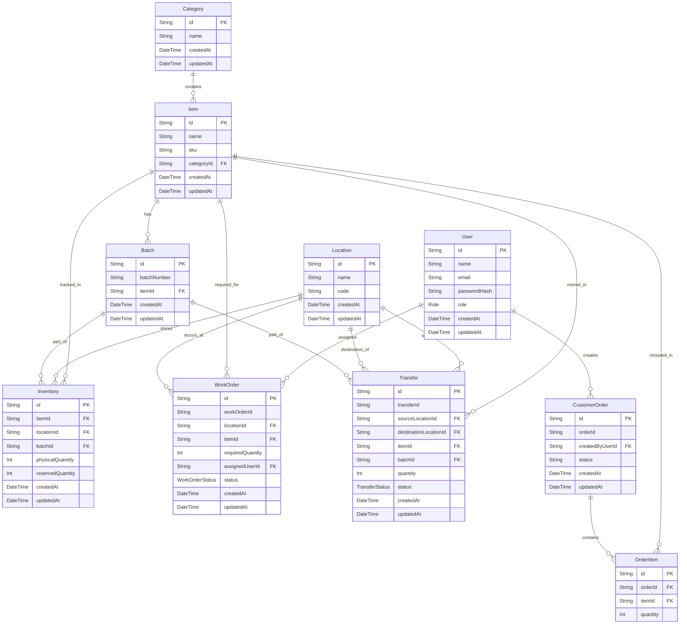

# Database Schema

Below is the Entity Relationship Diagram (ERD) mapping out the PostgreSQL database used in OpsFlow ERP.

### Key Concepts

- **Items & Categories**: Core definitions of physical goods. Every `Item` belongs to a `Category` and has a unique SKU.
- **Batches**: Used for lot tracking. Items can optionally have a `Batch` to track specific manufacturing runs or expirations.
- **Inventory**: The master record of physical goods. It creates a unique composite key combining `(itemId, locationId, batchId)`.
- **Locations**: Represents physical warehouses or specific zones.
- **Work Orders**: Instructions to assemble or process goods. Assigned to a specific `User`.
- **Transfers**: Movement of goods between two `Locations`.
- **Customer Orders**: Outbound sales orders, consisting of multiple `OrderItems`.
